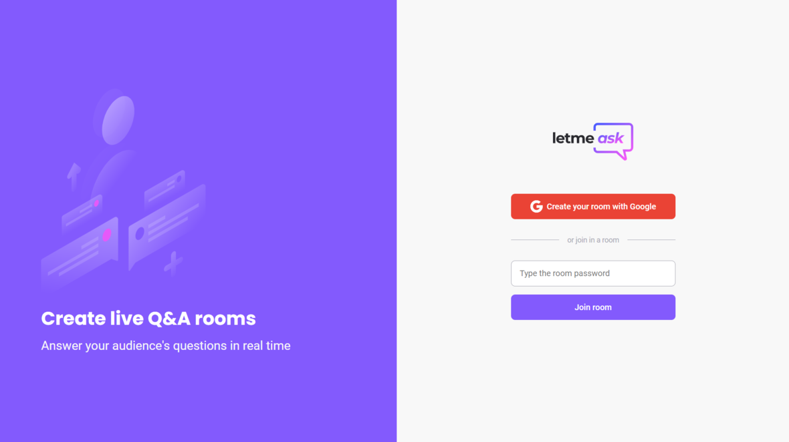

<div align="center" id="top"> 
  
</div>


<h4 align="center">
  Let Me Ask is a platform built to let you gather questions from your viewers during your stream and let them vote for which are the best questions for you to answer.
</h4>

<br>

<div align="center" id="top"> 
  
  ---
  
  ---
  
  ---
  
</div>

<br>

## Functionality

Every user can create a room and share the password to other people in order to they join. The normal user can make questions and give a like to them. The creator of the room can highlight, delete and mark a question as answered.

## Technologies

The following tools were used in this project:

- [React](https://pt-br.reactjs.org/)
- [TypeScript](https://www.typescriptlang.org/)
- [Sass](https://sass-lang.com/)
- [Firebase](https://firebase.google.com/)

## Getting started

First of all, you need to have [Git](https://git-scm.com) and [Node](https://nodejs.org/en/) installed.

```bash
# Clone this project
$ git clone https://github.com/viniciuspatzer/letmeask.git

# Access
$ cd letmeask

# Install dependencies
$ yarn install

# Run the project
$ yarn start

# The server will initialize on the localhost
```
